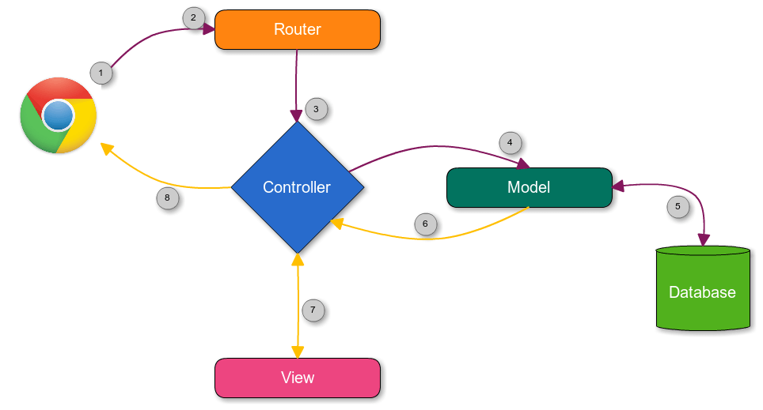
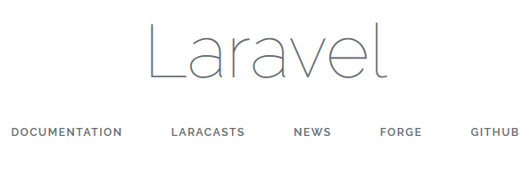
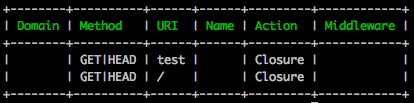



## Què és Laravel

* Laravel és un **framework PHP** orientat a objectes creat al 2005.
* Utilitza el model **MVC** (Model Vista Controlador).
* S'aprèn ràpidament.
* Requereix coneixements de PHP i programació orientacio objectes (POO).

---

## Patró MVC

* **MVC** són les sigles de **model-vista-controlador** (***model-view-controler***) que consisteix en un patró d'arquitectura del software.

* L'**aquitectura de software**, a semblança dels plànols d'un edifici o construcció, defineix la forma com s'oganitzen, interactuen i es relacionen entre sí les parts del programari.

* **MVC** permet no barrejar llenguatges de programació en el mateix codi.

* **MVC** devideix les aplicacions en 3 nivells :
  * **Modelo**: representa la lógica de negocios.
     * Es el encargado de accesar de forma directa a los datos actuando como “intermediario” con la base de datos.
  * **Vista**: es la encargada de mostrar la información al usuario de forma gráfica.
  * **Controlador**: es el intermediario entre la vista y el modelo. Es quien controla las interacciones del usuario solicitando los datos al modelo y entregándolos a la vista para que ésta, lo presente al usuario.

---

## MVC: Funcionament



1. L'**usuari** des del navegador accedeix una pàgina web.
2. Accedim a una **ruta** (ex: /, /usuaris, /registre).
3. Aquesta ruta té un **controlador** associat al que se'ns envia.
4. Si el controlador vol accedir a la base de dades, demana al **model** (Ex: Model Usuari) les dades.
5. El **model** s'encarrega d'interactuar amb la base de dades i retornar la informació al controlador per ser manipulada.
6. El **controlador** rep la informació i l'envia a la vista (una página html).
7. El **controlador** configura la **vista** i la retorna al navegador en formato HTML.

---

## Requiriments Laravel

* PHP >= 5.6.4
* OpenSSL PHP Extension
* PDO PHP Extension
* Mbstring PHP Extension
* Tokenizer PHP Extension
* XML PHP Extension

 Tots aquest requiriments són satisfets per la màquina virtual [Laravel Homestead](https://laravel.com/docs/5.3/homestead).

---

## Homestead


* L'equip de Laravel ens ofereix una màquina virtual anomenda **Homestead**, per facilitar-tos la preparació de l'entorn de desenvolupament en Laravel.
> **Homestead** és una "Box de Vagrant".

 > **Vagrant** és una capa per sobre de Virtualbox o VMWare que ens permet crear entorns de desenvolupament i les ***Boxs*** són imatges de sistemes operatius ja instal·lats.

**Included Software**:

* Ubuntu 16.04
* Git
* PHP 7.1
* Nginx
* MySQL
* MariaDB
* Sqlite3
* Postgres
* Composer
* Node (With Yarn, PM2, Bower, Grunt, and Gulp)
* Redis
* Memcached
* Beanstalkd

Documentació [Laravel Homestead](https://laravel.com/docs/5.3/homestead)

---

## Instal·lació i configuració

* Utilitzarem [Composer](https://getcomposer.org/) per descarregar-nos i instal·lar el Framework Larevel.

  1. Instal·la el gestor de paquets **[Composer](https://getcomposer.org/)** a la teva màquina.
  2. Instal·la **Laravel** seguint les indicacions de la [documentació](https://laravel.com/docs/5.3).

    Primer es descarrega l'instal·lador de Laravel via Composer:

    `composer global require "laravel/installer"`

    Laravel s'instal·la a $HOME/.composer però per poder executar les properes comandes necessitarem tenir $HOME/.composer/vendor/bin al nostre $PATH.
    Inserta això al teu $HOME/.profile:

    `PATH=$PATH:~/.composer/vendor/bin`

  3. Crea una app Laravel a la carpeta on guardaràs els teus projectes:

    `$ laravel new laravelapp1`

    Ens crea un nou directori amb la instal·lació de Laravel i totes les seves dependències.

    o també:

    `$ composer create-project --prefer-dist laravel/laravel laravelapp1`

  4. Arrenca l'aplicació de prova (inicia un petit servidor de desenvolupament):

    `$ php artisan serve`

  5. Comprova la app amb el navegador a:

    `http://localhost:8000`

   

---

## Artisan

* **Artisan** ens permet executar ordres des del terminal que ajuden a crear o modificar elements del nostre projecte en Laravel, com crear models, controladors, veure totes les rutes, etc ...

* Per poder executar les ordres de **Artisan**, des del terminal anem fins a la carpeta del projecte i un cop allà executem:

  `php artisan list`

* Aquesta comanda ens llita tot el que podem fer amb artisan.

---

## Rutes

* Les **rutes** en Laravel són les responsables d'indic....................

* Si nosaltres demanem la ruta **/tuits** volem que ens llisti tots els tuits.
* Si volem el tuit 1, tindrem una ruta com per exemple **/tuit/1**.

* Tant les peticions GET com POST les podem gestionar amb les rutes i controladors.

* Vegem l'arxiu de rutes situat a routes/web.php:

```php
<?php

/*
|--------------------------------------------------------------------------
| Web Routes
|--------------------------------------------------------------------------
| Here is where you can register web routes for your application. These
| routes are loaded by the RouteServiceProvider within a group which
| contains the "web" middleware group. Now create something great!
|
*/

Route::get('/', function () {
    return view('welcome');
});

```

* Veiem que només hi ha una ruta definida, que és l'arrel '/', la qual ens retorna una vista anomenada *welcome*.

* Totes les vistes són al directori **resources/views**.
* Si anem al directori views veiem que hi ha un arxiu anomenat **welcome.blade.php**.
* Quan cridem a la vista amb el mètode `view('welcome')` no cal posar-li l'extensió.
* Aquesta vista conté el Blade de la pàgina que veiem quan anem a l'arrel del projecte.

* Per veure les rutes que tenim definides podem utilizar la comanda Artisan:

  `php artisan route:list`

  I mostrarà algu com:

  

Documentació: [Routes](https://laravel.com/docs/5.3/routing)

### Rutes amb paràmetres
```php
<?php
   Route::get('inici/{nom}', function($nom){
   	return "Benvingut $nom";
   });
?>
```

També es poden enviar varis paràmetres:
```php
<?php
   Route::get('agenda/{mes}/{any}', function($mes, $any){
   	return "Mostrant l'agenda de $mes de $any";
   });
?>
```

### Rutes amb paràmetres opcionals

Podem definir rutes amb paràmetres opcionals com:

```
example.com/categoria/php
example.com/categoria/php/2
```

A vegades s'especifica la pàgina de la categoria i altres no simulant el funcionament d'un paginador.

En Laravel, el paràmetres opcionals s'indiquen amb un interrogant **?**.

```php
<?php
   Route::get('categoria/{categoria}/{pagina?}', function($categoria, $pagina = 1){
   	return "Mostrant categoria $categoria i pàgina $pagina";
   });
?>
```

---

## Estructura de carpetes

Alguns dels arxius que tenim directament a la carperta arrel de Laravel són:

* **.env**: És la definició de variables d'entorn.
* **composer.json**: Conté la informació pel gestor de paquets Composer.

Carpetes principals de Laravel:

* **App**: Arxius d'aplicació (Controladors, middlewares, etc)
* **Bootstrap**: Arxius del motor de Laravel. (No tocarem)
* **Config**: Arxius de configuració (Bases de dades, mail, etc)
* **Database**: Arxius de Migracions i Seeds.
* **Public**:  Arxius estàtics, són els arxius Públics de la nostra aplicació, els podran veure tots els usuaris que accedeixin a la nostra aplicació (Arxius CSS, Imatges, etc).
* **Resources**: Recursos de l'aplicació, com ara les Vistes.
* **Routes**: Arxius de definició de rutes.
* **Storage**: Arxius tals com memòria caché, sessions, logs, etc ... (No tocarem)
* **Tests**: Arxius per realitzar tests de la nostra aplicació perquè funcioni correctament. (No tocarem)
* **Vendor**: Les llibreries externes que gestiona Composer que són dependències de Laravel. (No s'ha de tocar)

---

## Vistes

* Les **vistes** s'encarreguen de mostrar la inforació a l'usuari.
* Les vistes consisteixen en uns arxius php que generen el codi HTML que s'envia al navegador.

* En Laravel, les vistes es guarden a la carpeta **resources/views/**.
   * I aquí es poden organitzar en carpetes per cada secció de l'aplicació.

* Laravel utilitza un sistema de plantilles anomenat **Blade**.
  * Per això els arxius tenen l'extensió **.blade.php**.

    > És molt important l'extensió, si no no funcionarà.

* Podem invocar una vista des del sistema de routing fent:

  ```php
   <?php
      Route::get('inici', function () {
          return view('inici');        //cridem la funció view passant el nom de la vista
      });
   ?>
   ```

### Passar dades una vista

* Podem passar dades a una vista a través d'un array associatiu.

```php
 <?php
 Route::get('/calendari', function () {
    view('calendari', [
       	'mes' => $mes,
       	'any' => $any,
       	'events' => $events
   ]);
});
?>
```

* L'arxiu `resources/views/calendari.blade.php` seria:

```html
<html>
    <body>
      <p>
          Estàs visualitzant el mes {{$mes}} i l'any {{$any}}.
      </p>
   </body>
</html>
```

Per mostrar dades en un arxiu blade, s'utilitzen les dobles claus {{ $data }}

---

## Controladors

* En Laravel, els **controladors** es guarden a la carpeta `app/Http/Controllers`.
   * I aquí es poden organitzar en subcarpetes.
* Codi d'un controlador bàsic:

```php
<?php
   namespace App\Http\Controllers;

   use App\Http\Controllers\Controller;

   class ArticulosController extends Controller
   //El controlador extén la classe base Controller de Laravel
   {
       public function ver($id)
       {
           return view('articulos.ver', ['id' => $id]);
       }
   }
?>
```

### Cridar un controlador des del sistema de routing

* Els controladors els cridarem, normalment, des del sistema de routing.
* Indicarem el nom del controlador i l'acció (mètode) que s'ha d'executar.

```php
<?php
   Route::get('articulos/{id}','ArticulosController@ver');
?>
```

* En aquest exemple, la ruta té un paràmetre que serà passat al mètode ver() del ArticulosController.

### Generar controladors automàticament amb artisan

* Crear controladors és una tasca repetitiva en Laravel, per això existiex una comanda artisan per crear-los automàticament.

  `php artisan make:controller CategoriasController`

---

## Models

  http://desarrolloweb.com/articulos/introduccion-modelos-laravel.html
